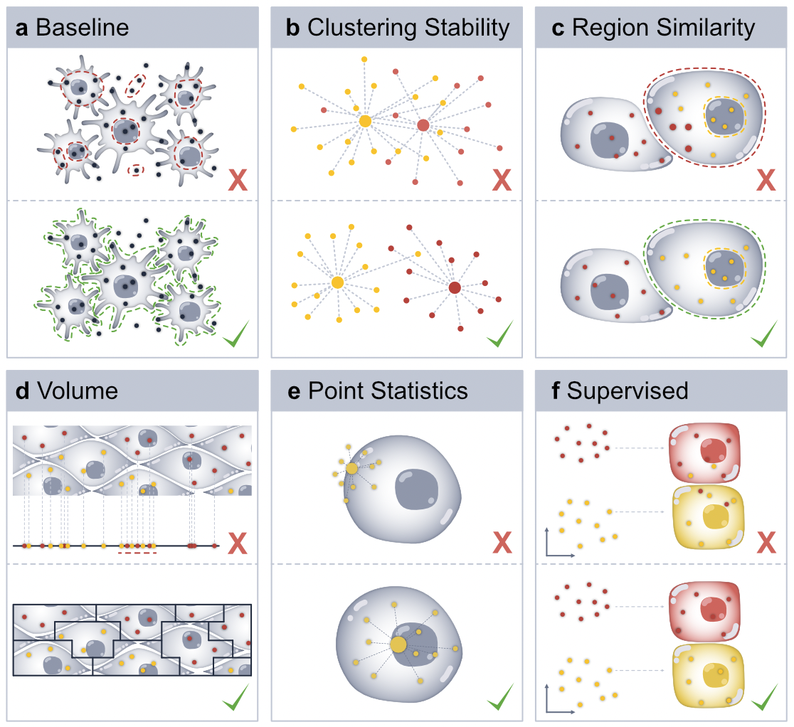

# SegTraQ

[](https://badge.fury.io/py/segtraq)

SegTraQ (**Seg**mentation and **Tra**nscript Assignment **Q**uality Control) is a Python toolkit for quantitative and visual quality control of segmentation and transcript assignment in spatial omics data.

> ⚠️ Note: SegTraQ is under active development. 
> Features, interfaces, and functionality may change in upcoming releases.
> To install the latest development version, run `pip install git+https://github.com/LazDaria/SegTraQ`.

<p align="center" width="100%">
    
</p>

## Getting Started
Please refer to the [documentation](https://lazdaria.github.io/SegTraQ) for details on the API and tutorials.

## Installation

To install `SegTraQ`, first create a python environment and install the package using 

```
pip install segtraq
```

The installation of the package should take less than a minute.

## System Requirements
### Hardware Requirements
`SegTraQ` requires only a standard computer with enough RAM to support the in-memory operations.

### Software Requirements
`SegTraQ` depends on the following packages:
```
scanpy
spatialdata
geopandas
igraph
rtree
rasterio
squidpy
anndata
ovrlpy
```